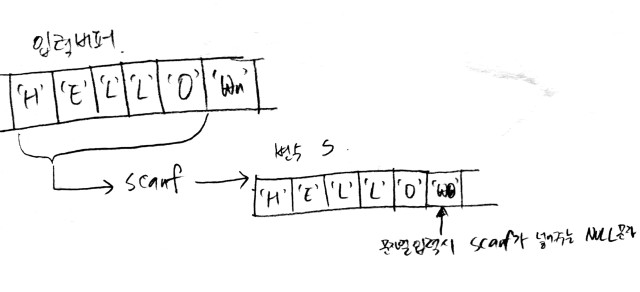
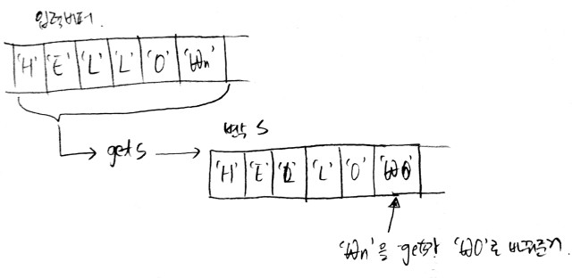

# 입출력

### A+B, A+B-2
케이스 하나를 입력받은 뒤, 출력하는 문제.
> **키보드 입력을 받는 객체**들은 사용후 리소스 낭비를 줄이기 위해 **꼭 종료**해야함!

close안하고 제출시 다른 제출코드에 비해 메모리 사용량이 훨씬 많았음.

```java
public static void main(String[] args) {
	Scanner sc = new Scanner(System.in);
	int a = sc.nextInt();
	int b = sc.nextInt();
	sc.close(); //중요
	System.out.println(a+b);
}
```


### A+B -3
여러케이스의 입력을 받은뒤 출력하는 문제.
여기서부턴 자바가 별거아닌거에 리소스 잡아먹는게 짜증나서 걍 c++로 갈아탐

```cpp
#include<iostream>
using namespace std;

int main() {
	int num_of_case;
	cin >> num_of_case;
	while(num_of_case-- > 0) {
		int a,b;
		cin >> a >> b;
		cout << a+b <<endl;
	}
}
```

### A+B -4
테스트케이스 개수가 정해지지않은 입력은 EOF를 만났을떄 종료해야한다.

자바버전
```java
Scanner sc = new Scanner(System.in);
while(sc.hasNext()) {
	int a = sc.nextInt();
	int b = sc.nextInt();
	System.out.println(a+b);
}
```

Cpp버전
```cpp
int a,b;
while(cin >> a >> b) { // 혹은 scanf("%d %d",&a,&b) ==2 
	cout << a+b <<endl;
}
```

### A+B -5
특정한 입력값(값이 모두 0일때)이 들어왔을때 종료

```cpp
int a,b;
while(cin >> a >> b) {
	if(a==0 && b==0)
		break;
	cout << a+b <<endl;
}
```

### A+B -6
주어진 테스트케이스 수만큼 콤마로 구분된 입력열을 받음
> 기본 입력문제를 풀면풀수록 c/c++이 대단하다는걸 느낌. 왠만하면 다 한줄로 표현됨.

cpp버전
```cpp
int num_of_case;
cin >> num_of_case;
while(num_of_case--) {
	int a,b;
	scanf("%d,%d",&a,&b);
	cout << a+b <<endl;
}
```


### A+B - 7,8
주어진 출력문의 형태로 출력하도록 하는 예제 (8번 생략)

다른 타입의 데이터를 함께 붙여서 출력할때
<br>cpp은 << 로, 자바는 + 를 이용하면된다.

```cpp
int num_of_test;
cin >> num_of_test;
for(int i =0; i < num_of_test; i++) {
	int a,b;
	cin >> a >> b;
	cout << "Case #" << (i+1) << ": " << a+b << endl;
}
```

> #### c++ 출력시 주의사항
> **cout << endl;**  
> * endl은 단순히 개행만하는게 아니라 개행하면서 출력버퍼를 비운다.
> 		+ 반복문에서 쓸경우 매번 출력버퍼를 비우게 되므로 안쓰는게 좋다.
> * cout 보다 printf를 쓰는게 속도면에서 훨씬 우수


### 그대로 출력하기
EOF가 나올때까지 사용자가 입력한 문자열을 그대로 출력한다.

자바 코드
```java
Scanner sc = new Scanner(System.in);
while(sc.hasNext()) {
	String s = sc.nextLine();
	System.out.println(s);
}
sc.close();
```

#### scanf("%[]")로 공백 포함한 문자열 입력받기
[] 안에 패턴구문을 넣으면 입력형식을 제한할수있다.
<br> ex) %[a-z] -->알파벳 형식의 문자열
<br> ex) %[^0-9] -->숫자 제외한 문자열
<br> ex) %10[^\n] -->공백을 포함한 최대 10자리 문자열

```cpp
char s[100];
while(scanf("%[^\n]",s)!= -1) {
	getchar();//입력버퍼에 있는 개행문자 비움
	printf("%s\n",s);
}
```


### 그대로 출력하기2
공백을 포함한 문자열을 받고 출력또한 공백과 함께 출력하도록 함.  
문제의 핵심은 **빈줄을 입력했을때도 빈줄(엔터만 친 입력) 또한 출력**하게 하는 것이다.

자바코드는 윗문제와 같으나 c/c++의 경우 **scanf로 받았을때 빈줄입력이 변수에 저장되지 않았다.**

```cpp
char s[100];
while(scanf("%[^n]",s)!= -1) {
	getchar();
	printf("%s\n",s);
}
```

위의 코드 실행결과
```
    space
    space
    <- 스페이스바만 입력한줄
    <- 스페이스바로 입력한 문자열이 출력됨
enter
enter
		<- 엔터만 입력한줄.
enter   <- 이전에 입력한 문자열이 출력되는것을 볼수있다.
```

scanf대신 gets를 쓰면 제대로된 결과값이 나온다.
```cpp
char s[100];
while(gets(s)!=NULL) {
	puts(s);
}
```

왜 이런 결과가 나오는걸까?  
이를 이해하기위해선 **입력 버퍼**와 **scanf/gets의 차이점**에 대해 알필요가 있다.


#### 데이터 입력과 버퍼
우리가 키보드로 입력을 받을때 사용되는 버퍼는 2가지임  
- 키보드 입력 버퍼  
- 프로세스 입력 버퍼  

우리가 입력함수를 통해 입력받을때 아래와 같은 프로세스가 이루어짐  
1. 키보드로 입력한 값들은 키보드버퍼로 즉시 저장됨  
2. 엔터키가 입력되면 키보드버퍼에 있는 값들이 입력버퍼로 이동  
3. 입력함수가 입력버퍼안에있는 값을 변수로 옮김
> 여기서 중요한건 입력함수(scanf,gets,,)는 키보드로 뚱땅뚱땅 쳤을때 입력값을 받아오는게 아니라 그냥 입력버퍼에서 정해진 값을 꺼내오는것임

#### scanf와 gets의 차이
scanf는 "%[]"안에 입력으로 인정한 데이터까지 입력버퍼에서 변수로 옮긴다.  
> 문자열입력후 엔터를 치면 \n 이전까지의 문자열만 변수로 옮기고 \n는 입력버퍼에 남아있게됨  
> 그래서 scanf를 연속으로 사용할경우 getchar()를 이용하여 입력버퍼안에있는 \n을 비워야한다  


gets는 \n값을 \0(null)값으로 바꾼후 프로세스버퍼에 있는 값을 변수로 옮김[^1]  


따라서 엔터키만 입력할 경우,  
**scanf**는 입력버퍼에서 갖고올 문자열이없으므로 변수에 값을 새로 할당하지않음   
(그래서 이전 데이터가 그대로 남아있음)  
**gets**는 버퍼에있는 \n값을 \0로 바꾸어 변수에 저장  
(따라서 변수에 널값이 저장됨)


### 숫자의 합, 열개씩 끊어 출력하기
공백없이 들어온 입력을 구분하여 처리하는 문제  
scanf의 입력패턴만 잘 정의해주면 됨

```cpp
int num,in,sum = 0;
scanf("%d",&num);
while(num--) {
	scanf("%1d",&in);
	sum+=in;
}
printf("%d",sum);
```

```cpp
char word[101];
while(scanf("%10s",word) != -1) {
	printf("%s\n",word);
}
```

[^1]: [출처](https://www.ibm.com/support/knowledgecenter/ko/ssw_ibm_i_73/rtref/gets.htm)